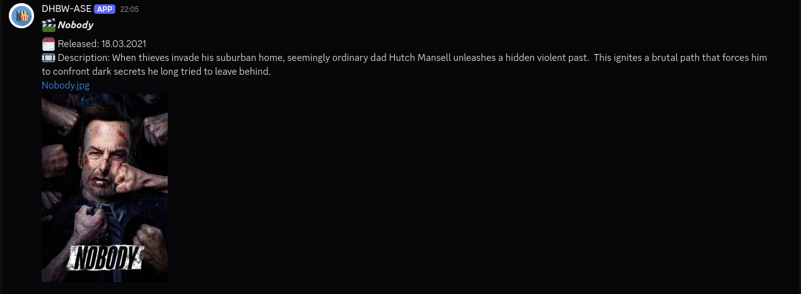
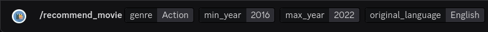

# ASE Discord Bot




A Discord bot that provides random movie and TV show recommendations based on filters. The data is taken from TheMovieDB's API and OpenRouter's API is used to generate a description with ai.

Below is an example of a well-structured and visually appealing README.md for your project:

## Requirements

This project requires the following credentials to function properly:
- A **Discord Bot Token** (`DISCORD_TOKEN`)
- A **TMDB Read Access Token** (`TMDB_READ_ACCESS_TOKEN`)
- An **Open Router API Key** (`OPEN_ROUTER_API_KEY`)
- A valid **Discord Guild ID** (`DISCORD_GUILD_ID`) for your target server

## Table of Contents

- [Installation](#installation)
- [Configuration and Environment Variables](#configuration-and-environment-variables)
- [Usage](#usage)
- [Commands](#commands)
- [Project Structure](#project-structure)
- [Docker Setup](#docker-setup)
- [Scripts](#scripts)
- [License](#license)

## Installation

1. **Clone the Repository:**

   ```bash
   git clone https://github.com/seyfu-t/ase-discord-bot.git
   cd ase-discord-bot
   ```

2. **Install Dependencies:**
   This project uses [Poetry](https://python-poetry.org/) for dependency management.

   ```bash
   poetry install
   ```

   It is recommended to use virtual environments for installing python dependencies. For that you can use poetry to manage a virtual environment for you. Or you can run `scripts/install-deps.sh` which sets up a virtual environment inside a `.venv` and then you can switch to that environment.

   ```bash
   bash scripts/install-deps.sh
   source .venv/bin/activate
   ```

## Configuration and Environment Variables

All available settings are defined in `src/ase_discord_bot/config.py`. Configure the bot by setting environment variables. You can use a `.env` file, and optionally a `.env.dev` or `.env.prod` file (depending on the `MODE` environment variable) placed in the root of the project.

**Required Environment Variables:**
- `TMDB_READ_ACCESS_TOKEN`: TMDB API read access token.
- `DISCORD_TOKEN`: Discord bot token.
- `DISCORD_GUILD_ID`: Discord Guild ID.
- `OPEN_ROUTER_API_KEY`: Open Router API key.

**Optional Environment Variables:**
- `DISCORD_AVATAR`: URL or path to the bot avatar image (defaults to `assets/avatar.jpg`).
- `DISCORD_BANNER`: URL or path to the bot banner image (defaults to `assets/banner.jpg`).
- `DISCORD_USERNAME`: Desired username for the bot (defaults to `DHBW-ASE`).
- `MODE`: Operating mode (`prod` or `dev`, default is `dev`), which determines whether `.env.prod` or `.env.dev` is loaded.
- `MAX_API_PAGES_COUNT`: Maximum number of pages for API queries (defaults to `15`).
- `MIN_VOTE_COUNT`: Minimum vote count for filtering recommendations (defaults to `4000`).


## Usage

### Running the Bot Locally

To start the Discord bot, run:

```bash
bash scripts/run.sh
```

### Available Commands

- **/recommend_movie**  
  Provides a movie recommendation based on genre, release year (or year range) and language.
- **/recommend_tvshow**  
  Provides a TV show recommendation based on the same parameters.
- **/help**  
  Displays help information with command usage and descriptions.

## Project Structure

```
.
├── assets/              # Static assets (images, JSON data from the TMDB API for languages and genres)
├── docker/              # Docker and compose files
├── docs/                # Sphinx documentation source files
├── scripts/             # Utility scripts for building, testing, dockerizing etc...
├── src/                 # Source code for the Discord bot
│   └── ase_discord_bot/
│       ├── ai/        # AI module for summarization
│       ├── api_util/   # API utilities and data models for recommendations
│       ├── bot/       # Bot commands and message formatting utilities
│       ├── config.py  # Core configuration settings
│       ├── config_registry.py  # Registry for environment-specific settings
│       └── main.py    # Application entry point
└── test/                # Tests
```

## Docker Setup

For containerized deployments, use Docker:

1. **Build the Docker Image:**

   ```bash
   bash scripts/dockerize.sh
   ```

2. **Run the Container via Docker Compose:**
   ```bash
   docker compose --file docker/docker-compose.yml up -d
   ```

   Note: both compose files have all the required env variables commented out, so you must first add them before using it.

## Scripts

The `scripts/` directory includes several helpful scripts:

- `dockerize.sh` - Builds the Docker images.
- `generate-docs.sh` - Generates project documentation via [sphinx](https://www.sphinx-doc.org/en/master/).
- `run.sh` - Runs the bot.
- `test.sh` - Executes all tests.
- `generate_genre_enums.py` - Used to generate `src/ase_discord_bot/api_util/model/genres.py`
- `generate_languages_enum.py` - Used to generate `src/ase_discord_bot/api_util/model/languages.py`

## License

This project is licensed under the terms specified in the [LICENSE](LICENSE) file.
